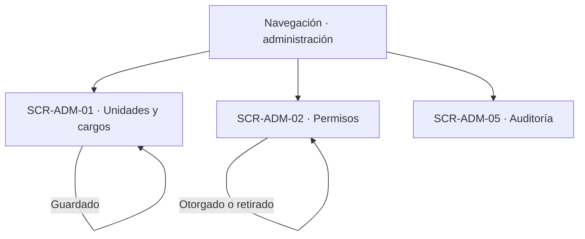
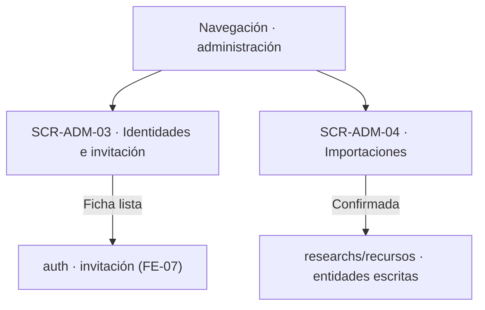

# Navegación funcional — Administration

## Alcance y referencias

Conecta las cinco superficies definidas en [screens.md](screens.md), a partir de [user-flow.md](user-flow.md), [business-rules.md](business-rules.md) y [data-model.md](data-model.md). No define URLs, pantallas externas ni nuevas operaciones. Los destinos externos son responsabilidades funcionales documentadas; los estados de error se mantienen en la superficie que originó la operación.

## Entradas e inicio

- **Acceso administrativo:** todas las superficies exigen cuenta activa con alcance global y el permiso de su sección; sin ese alcance, el rechazo ocurre en la superficie que lo recibe.
- **Cuentas de FE-07:** invitar y administrar cuentas ya tienen pantallas (`administracion/cuentas/invitar`, `administracion/cuentas/[idCuenta]`); se referencian desde `SCR-ADM-03`, no se redefinen aquí.

## Estructura, permisos y auditoría

| Origen | Acción o decisión | Destino / resultado | Trazabilidad |
|---|---|---|---|
| Navegación | Gestionar unidades y cargos | SCR-ADM-01 | Contrato §2 |
| SCR-ADM-01 | Nombre duplicado o ciclo | SCR-ADM-01, corrección | RN-UNI-02, RN-UNI-03 |
| SCR-ADM-01 | Estado cambiado | SCR-ADM-01, confirmación | RN-UNI-04, RN-UNI-05, RN-HAB-05 |
| Navegación | Asignar permisos | SCR-ADM-02 | Contrato §3 |
| SCR-ADM-02 | Otorgar o retirar | SCR-ADM-02, confirmación | RN-PER-03 a RN-PER-09 |
| SCR-ADM-02 | Retirar el último permiso global | SCR-ADM-02, rechazo | RN-AUTH-ROL-09 de auth |
| SCR-ADM-05 | Consultar con filtros | SCR-ADM-05, registro disponible | RN-AUD-01 a RN-AUD-07 |

## Identidades e importaciones

| Origen | Acción o decisión | Destino / resultado | Trazabilidad |
|---|---|---|---|
| Navegación | Registrar identidades | SCR-ADM-03 | UF-ADM-02, UF-ADM-03 |
| SCR-ADM-03 | Datos inválidos o duplicados | SCR-ADM-03, corrección | RN-DAT, RN-PRS-05 de usuarios |
| SCR-ADM-03 | Ficha lista | Invitación desde auth (pantallas de FE-07) | UF-AUTH-02 de auth |
| Navegación | Importar catálogo | SCR-ADM-04 | UF-ADM-01, UF-ADM-04 |
| SCR-ADM-04 | Fila en error | SCR-ADM-04, no confirmable | RN-IMP-06 |
| SCR-ADM-04 | Confirmada | SCR-ADM-04, totales definitivos | RN-IMP-08, RN-IMP-10 |
| SCR-ADM-04 | Entidades escritas | Módulos propietarios (`researchs`, `recursos`) | RN-IMP-05, RN-IMP-09 |

## Cruces con otros módulos

| Módulo | Cruce documentado | Naturaleza |
|---|---|---|
| auth | Invitación de cuentas y pantallas de cuentas existentes | Dependencia de conducción; sin pantalla propia de auth aquí |
| usuarios | Persistencia y validación de identidades (`RN-DAT`, `RN-PRS-05`) | Dependencia funcional; este módulo orquesta |
| researchs | Escritura de proyectos y semilleros importados; catálogos y validaciones | Dependencia funcional; este módulo orquesta |
| recursos | Escritura de equipos importados; deshabilitación individual fuera de importación | Dependencia funcional; este módulo orquesta |
| reservations | Cancelaciones por deshabilitación que la importación nunca provoca | Límite explícito (`RN-IMP-09`), sin pantalla compartida |

## Efectos transversales sin pantalla propia

| Flujo | Decisión | Efecto sobre la interfaz y referencia |
|---|---|---|
| UF-ADM-02 | Continuar a invitar tras el alta | Conduce a la invitación de auth, sin superficie propia de cuentas aquí |
| RN-IMP-09 | Equipos nunca deshabilitados por importación | Sin estado de deshabilitación en `SCR-ADM-04` |

## Verificación y asuntos sin resolver

- Revisados los cuatro flujos, de `UF-ADM-01` a `UF-ADM-04`; la matriz de [screens.md](screens.md) deja trazabilidad de cada uno, más las tres superficies de contrato sin flujo propio (§2, §3, §5).
- Todos los identificadores `SCR-ADM-XX` utilizados corresponden a las cinco definiciones de ese documento. Los demás nodos de los diagramas son decisiones, resultados en la misma vista o módulos externos documentados.
- No se crea una pantalla para cuentas y sesiones de auth: pertenecen a `FE-07`.
- Quedan aplicadas las decisiones sobre agrupar identidades con invitación y sobre documentar sin inventar flujos las superficies de contrato. Se mantienen únicamente los asuntos fuera de esas decisiones: mecanismo de selección en formularios, destino tras guardar o confirmar y retornos no definidos. Ninguna flecha presupone una solución a esos asuntos.
