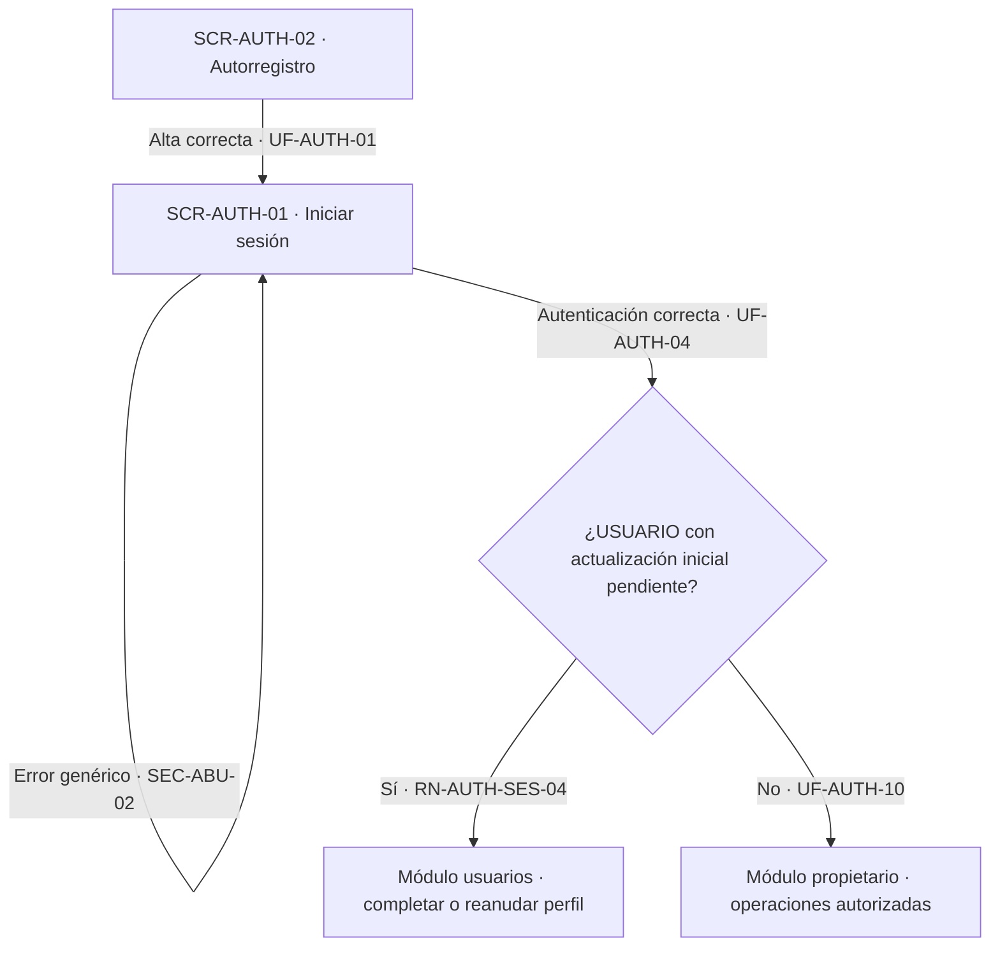
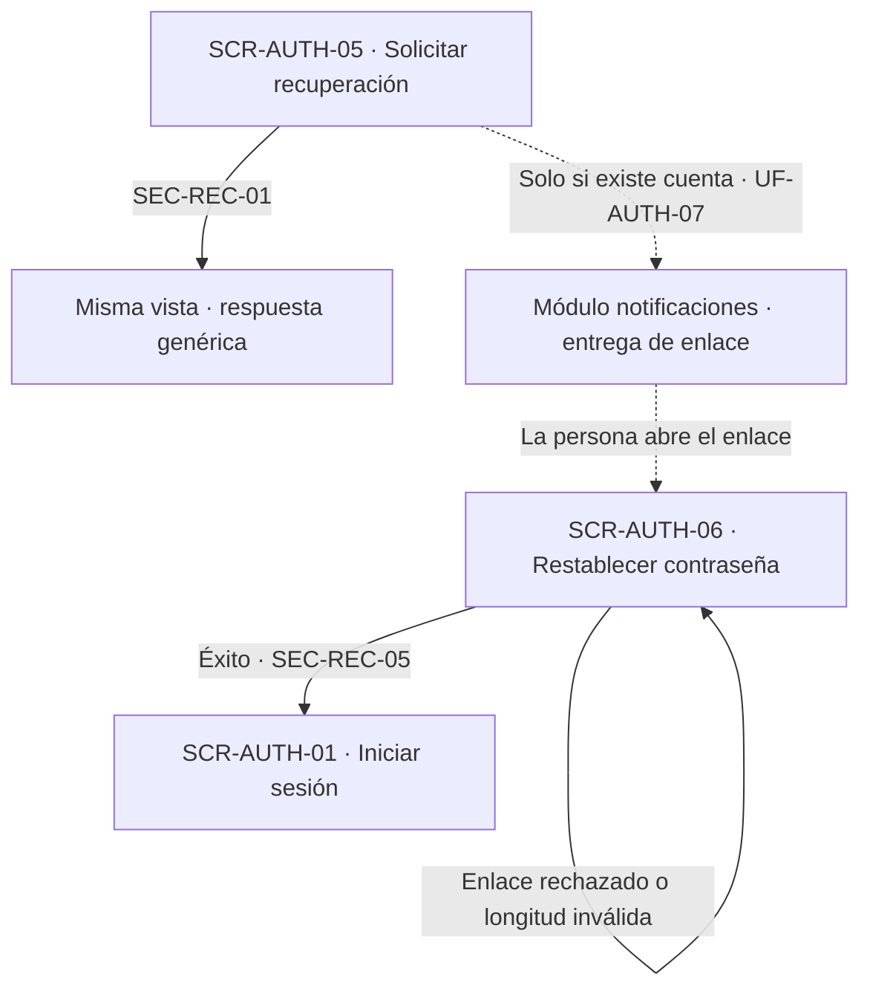

# Navegación funcional — Auth

## Alcance y referencias

Conecta las nueve superficies definidas en [screens.md](screens.md), a partir de [user-flow.md](user-flow.md), [business-rules.md](business-rules.md), [security.md](security.md), [data-model.md](data-model.md) y [overview.md](overview.md). No define URLs, pantallas externas ni nuevas operaciones. Los destinos externos son responsabilidades funcionales documentadas; los estados de error se mantienen en la superficie que originó la operación.

## Entradas e inicio

- **Entrada de autenticación:** `SCR-AUTH-01`, iniciar sesión (`UF-AUTH-04`). Las fuentes no definen una pantalla inicial universal de la aplicación.
- **Autorregistro y recuperación:** sus opciones conducen respectivamente a `SCR-AUTH-02` y `SCR-AUTH-05` (`UF-AUTH-01`, `UF-AUTH-07`). No exigen sesión previa.
- **Enlaces recibidos por correo:** invitación → `SCR-AUTH-04`; recuperación → `SCR-AUTH-06`. Son entradas independientes del inicio de sesión y requieren validación del token antes de continuar (`SEC-TOK-01`, `SEC-INV-02`, `SEC-REC-03`).
- **Contexto autenticado:** opción de cambiar contraseña → `SCR-AUTH-08`; operación sensible que necesita reautenticación → `SCR-AUTH-07` (`UF-AUTH-09`, `UF-AUTH-11`).
- **Administración de cuentas:** opción de invitar → `SCR-AUTH-03`; acceso a cuenta objetivo para estado/tipo → `SCR-AUTH-09` (`UF-AUTH-02`, `UF-AUTH-12`, `UF-AUTH-13`). Las fuentes no concretan la pantalla o mecanismo previo de selección; no se crea un listado adicional.

## Autorregistro, autenticación y perfil

| Origen | Acción o decisión | Destino / resultado | Trazabilidad |
|---|---|---|---|
| SCR-AUTH-01 | Acceder a registro | SCR-AUTH-02 | UF-AUTH-01 |
| SCR-AUTH-01 | Acceder a recuperación | SCR-AUTH-05 | UF-AUTH-07 |
| SCR-AUTH-02 | Registro correcto | SCR-AUTH-01; el alta no inicia sesión ni completa perfil | UF-AUTH-01, RN-AUTH-ID-06, RN-AUTH-ID-09 |
| SCR-AUTH-02 | Faltan datos, están vacíos, correo con formato inválido o longitud de contraseña no admitida | SCR-AUTH-02, corrección de entradas | UF-AUTH-01, SEC-PWD-07 |
| SCR-AUTH-02 | Conflicto de correo | SCR-AUTH-02, respuesta pública genérica y orientación a SCR-AUTH-05 | UF-AUTH-01, RN-AUTH-ID-02, SEC-ABU-02, SEC-REC-01 |
| SCR-AUTH-02 | Documento o teléfono registrado | SCR-AUTH-02, respuesta pública genérica; no se crea el alta | UF-AUTH-01, RN-AUTH-ID-06 |
| SCR-AUTH-01 | Credenciales no válidas o cuenta/identidad inactiva | SCR-AUTH-01, rechazo sin distinguir causa que revele existencia de cuenta | UF-AUTH-04, RN-AUTH-ID-01, RN-AUTH-ID-05, SEC-ABU-02 |
| SCR-AUTH-01 | Autenticación correcta de USUARIO con perfil pendiente | Módulo usuarios / completar o reanudar actualización inicial | UF-AUTH-04, RN-AUTH-SES-04; RN-USR-07 y RN-USR-08 de usuarios |
| SCR-AUTH-01 | Autenticación correcta de USUARIO con actualización completada | Módulo propietario de las operaciones autorizadas; pantalla concreta no definida | UF-AUTH-04, UF-AUTH-10, RN-AUTH-ROL-08 |
| SCR-AUTH-01 | Autenticación correcta de PERSONAL | Módulo propietario de las operaciones autorizadas, sin condición de actualización inicial | UF-AUTH-04, UF-AUTH-10, RN-AUTH-ROL-02, RN-AUTH-ROL-03, RN-AUTH-ROL-04 |
| SCR-AUTH-01 o SCR-AUTH-02 | Límite de intentos superado | Misma superficie, operación limitada; no se continúa por haber superado el control de abuso | SEC-ABU-01, SEC-ABU-03 |

El recorrido de autorregistro referencia `usuarios` / `UF-USR-01` en `UF-AUTH-01`. La activación invitada referencia `usuarios` / `UF-USR-02` en `UF-AUTH-03`. No se unifican esos destinos ni se asigna un identificador externo al inicio de sesión, cuya fuente solo dice completar o reanudar el perfil. El retorno después del perfil lo define `usuarios`, no Auth.

El nodo de decisión representa una consulta del servidor; no pide al usuario elegir tipo de cuenta ni declarar que completó su perfil.

## Invitación y activación

| Origen | Acción o decisión | Destino / resultado | Trazabilidad |
|---|---|---|---|
| SCR-AUTH-03 | Emitir invitación válida | SCR-AUTH-03, resultado de emisión; notificaciones entrega el enlace | UF-AUTH-02, RN-AUTH-ID-07, SEC-INV-01 |
| SCR-AUTH-03 | Reenviar invitación no completada | SCR-AUTH-03, nueva emisión; invalida la invitación anterior | UF-AUTH-02, RN-AUTH-ID-10, SEC-INV-03 |
| SCR-AUTH-03 | Identidad/unidad/correo no cumplen las validaciones | SCR-AUTH-03, emisión no completada; creación/corrección de identidad pertenece a usuarios o administration | UF-AUTH-02, RN-AUTH-ID-02, RN-AUTH-ID-07 |
| SCR-AUTH-03 | Cuenta de alta completada posteriormente desactivada administrativamente | SCR-AUTH-03, rechazo de emisión; indicar al Administrador que corresponde UF-AUTH-12 en SCR-AUTH-09 | UF-AUTH-02, RN-AUTH-ID-10 |
| SCR-AUTH-03 | Tipo o ámbito no autorizado | SCR-AUTH-03, denegación | SEC-AUTZ-02, SEC-AUTZ-04 |
| Enlace de invitación entregado por notificaciones | La persona invitada lo abre | SCR-AUTH-04, validación previa del token | UF-AUTH-03, SEC-TOK-01, SEC-INV-02 |
| SCR-AUTH-04 | Token inválido, vencido, utilizado o revocado | SCR-AUTH-04, no completa alta; orienta a solicitar nueva invitación | SEC-INV-02, SEC-TOK-05 |
| SCR-AUTH-04 | Ficha de PERSONAL desactivada, eliminada o con correo distinto | SCR-AUTH-04, rechazo; corrección de ficha en administration y nueva invitación por actor autorizado | UF-AUTH-03, RN-AUTH-ID-05, RN-AUTH-ID-07 |
| SCR-AUTH-04 | Cuenta de alta completada posteriormente desactivada administrativamente | SCR-AUTH-04, rechazo sin reactivar ni iniciar sesión y sin revelar innecesariamente datos de la cuenta; no se redirige al invitado a administración | UF-AUTH-03, RN-AUTH-ID-10, SEC-ABU-02 |
| SCR-AUTH-04 | Contraseña fuera de longitud admitida | SCR-AUTH-04, solicitar corrección | SEC-PWD-07 |
| SCR-AUTH-04 | Activación correcta de USUARIO | Sesión iniciada → módulo usuarios / UF-USR-02 | UF-AUTH-03, RN-AUTH-SES-04, SEC-SES-13 |
| SCR-AUTH-04 | Activación correcta de PERSONAL | Sesión iniciada → módulo propietario de operaciones autorizadas | UF-AUTH-03, UF-AUTH-10 |
| SCR-AUTH-04 | Persona abandona sin completar | No hay cuenta utilizable por esa activación; destino de salida no definido | UF-AUTH-03 |
| SCR-AUTH-03 o SCR-AUTH-04 | Control de abuso limita la operación | Misma superficie, sin completar la operación restringida | SEC-ABU-01 |

La emisión no redirige al Administrador a la activación. La solicitud de una nueva invitación es una orientación al invitado: no implica acceso público a `SCR-AUTH-03`, que requiere Administrador autorizado. Tampoco otorga acceso público a pantallas de `administration` para corregir fichas.

## Recuperación de contraseña

| Origen | Acción o decisión | Destino / resultado | Trazabilidad |
|---|---|---|---|
| SCR-AUTH-05 | Solicitar recuperación, exista o no cuenta | SCR-AUTH-05, respuesta equivalente; solo si existe cuenta se solicita entrega a notificaciones | UF-AUTH-07, SEC-REC-01, SEC-REC-02 |
| SCR-AUTH-05 | Límite de solicitudes superado | SCR-AUTH-05, operación limitada | SEC-ABU-01 |
| Enlace de recuperación entregado por notificaciones | La persona lo abre | SCR-AUTH-06, validación previa del token | UF-AUTH-08, SEC-TOK-01, SEC-REC-03 |
| SCR-AUTH-06 | Token inválido, vencido, usado o revocado | SCR-AUTH-06, rechazo sin cambiar contraseña | SEC-TOK-01, SEC-TOK-05 |
| SCR-AUTH-06 | Nueva contraseña no cumple longitud | SCR-AUTH-06, solicitar corrección | SEC-PWD-07 |
| SCR-AUTH-06 | Restablecimiento correcto | SCR-AUTH-01, exige nueva autenticación; notificaciones informa del cambio | UF-AUTH-08, SEC-REC-04, SEC-REC-05, SEC-SES-10 |

No hay transición automática de `SCR-AUTH-05` a `SCR-AUTH-06`: el enlace recibido inicia el segundo tramo. La fuente no define un retorno específico desde un enlace rechazado; la opción pública de recuperación sigue siendo `SCR-AUTH-05`, sin prescribir un botón adicional o envío automático.

Las líneas discontinuas representan entrega y apertura de correo, no redirecciones entre pantallas.

## Reautenticación y cambio de contraseña

| Origen | Acción o decisión | Destino / resultado | Trazabilidad |
|---|---|---|---|
| SCR-AUTH-08 u operación sensible del módulo propietario | La autenticación reciente no satisface la ventana configurada | SCR-AUTH-07, solicitar únicamente contraseña actual de la cuenta identificada por la sesión; operación sensible pendiente | UF-AUTH-09, UF-AUTH-11, SEC-REAUTH-01, SEC-REAUTH-02 |
| Mismo origen | La autenticación reciente satisface la ventana configurada conforme a UF-AUTH-09 | Continúa en el origen sin abrir SCR-AUTH-07 ni solicitar reautenticación adicional | UF-AUTH-09, SEC-REAUTH-01 |
| SCR-AUTH-07 | Contraseña actual validada | Retorno a SCR-AUTH-08 o a la operación sensible del módulo propietario que la originó | UF-AUTH-09, SEC-REAUTH-03, SEC-REAUTH-04 |
| SCR-AUTH-07 | Reautenticación fallida | SCR-AUTH-07, error; operación sensible sin ejecutar | UF-AUTH-09, UF-AUTH-11 |
| SCR-AUTH-07 | Límite de intentos superado | SCR-AUTH-07, limitación; no ejecuta operación sensible | SEC-ABU-01 |
| SCR-AUTH-08 | Nueva contraseña no cumple longitud | SCR-AUTH-08, solicitar corrección | SEC-PWD-07 |
| SCR-AUTH-08 | Cambio correcto | Todas las sesiones activas revocadas, incluida la actual; no se crea automáticamente una nueva sesión. Continuar a SCR-AUTH-01 para iniciar sesión con la nueva contraseña; notificaciones informa del cambio | UF-AUTH-11, UF-AUTH-04, SEC-REC-04, SEC-SES-10 |

Para cambiar contraseña, si la ventana no se satisface se completa `SCR-AUTH-07` antes de continuar a `SCR-AUTH-08`; si se satisface, se continúa directamente en `SCR-AUTH-08`. No se solicita nuevamente correo ni se incorporan otros factores.

El retorno de reautenticación conserva el propósito de la operación pendiente; no la autoriza por sí mismo ni supone ejecución automática sin las validaciones del módulo propietario (`UF-AUTH-10`, `RN-AUTH-ROL-08`). La gestión de permisos en `administration` es un origen externo explícitamente mencionado en `UF-AUTH-09`, sin identificador de flujo externo en las fuentes.

## Estado y tipo de identidad de la cuenta

| Origen | Acción o decisión | Destino / resultado | Trazabilidad |
|---|---|---|---|
| SCR-AUTH-09 | Desactivar cuenta, con autorización y sin vulnerar protección administrativa | SCR-AUTH-09, cuenta inactiva; revoca sesiones de la cuenta objetivo y conserva historial | UF-AUTH-12, RN-AUTH-ID-05, RN-AUTH-ROL-09, SEC-SES-10 |
| SCR-AUTH-09 | Reactivar cuenta autorizadamente | SCR-AUTH-09, estado actualizado; conserva identificador y relaciones, sin crear identidad | UF-AUTH-12; RN-HAB-04 de administration |
| SCR-AUTH-09 | Cambiar tipo con identidad destino válida, exclusiva y correo coincidente | SCR-AUTH-09, tipo/vínculo actualizado; permisos se gestionan en administration | UF-AUTH-13, RN-AUTH-ID-02, RN-AUTH-ID-03, RN-AUTH-ID-04, RN-AUTH-ROL-04 |
| SCR-AUTH-09 | Identidad inexistente/inactiva, correo distinto o exclusividad incumplida | SCR-AUTH-09, rechazo sin aplicar cambio | UF-AUTH-13, RN-AUTH-ID-02, RN-AUTH-ID-03 |
| SCR-AUTH-09 | Desactivar o cambiar tipo dejaría sin la última cuenta administrativa válida | SCR-AUTH-09, rechazo | UF-AUTH-12, UF-AUTH-13, RN-AUTH-ROL-09 |
| SCR-AUTH-09 | Fuera del permiso/ámbito autorizado | SCR-AUTH-09, denegación | SEC-AUTZ-02, SEC-AUTZ-04 |

Si el servidor exige reautenticación para una operación sensible de esta superficie, se aplica el recorrido general `SCR-AUTH-09` → `SCR-AUTH-07` → `SCR-AUTH-09` (`UF-AUTH-09`, `SEC-REAUTH-02`). No se inventa una lista adicional de acciones sensibles. La sesión del actor, incluida una eventual sesión de la cuenta desactivada, siempre queda sujeta a `UF-AUTH-05`.

No se prescribe una transición directa entre `SCR-AUTH-03` y `SCR-AUTH-09`: las fuentes solo comparten el contexto funcional de administración de cuentas. Tampoco se crea una pantalla Auth de asignación de permisos.

## Efectos transversales sin pantalla propia

| Flujo | Decisión | Efecto sobre la interfaz y referencia |
|---|---|---|
| UF-AUTH-05 | Sesión vigente y cuenta/identidad activas | Continúa en la superficie solicitante; validación/renovación en segundo plano cuando el diseño la contemple (`RN-AUTH-SES-01`, `SEC-SES-07`, `SEC-SES-09`) |
| UF-AUTH-05 | Sesión vencida, cerrada o revocada | Interrumpe operación autenticada y exige SCR-AUTH-01; conservar cookie no habilita continuidad (`RN-AUTH-SES-05`, `SEC-SES-07`, `SEC-SES-09`) |
| UF-AUTH-05 | Cuenta o identidad desactivada | Dejan de permitirse operaciones autenticadas; intentar SCR-AUTH-01 no supera la inactividad (`RN-AUTH-ID-01`, `RN-AUTH-ID-05`) |
| UF-AUTH-06 | Seleccionar cerrar sesión | Termina sin sesión válida; destino visual posterior no especificado. Si ya estaba vencida/revocada, resultado equivalente (`RN-AUTH-SES-02`, `SEC-SES-08`) |
| UF-AUTH-10 | Identidad, permiso con alcance efectivo global o por unidad, pertenencia y condición de perfil válidos | Continúa en la operación del módulo propietario, que aplica sus propias reglas (`RN-AUTH-ROL-05`, `RN-AUTH-ROL-07`, `SEC-AUTZ-06`) |
| UF-AUTH-10 | Permiso no comprobable, ámbito indebido o recurso no permitido | Denegación en la superficie solicitante; no se inventa una pantalla de acceso denegado ni se envía al inicio de sesión solo por faltar permiso (`SEC-AUTZ-02`, `SEC-AUTZ-04`, `SEC-AUTZ-06`) |
| UF-AUTH-10 | USUARIO con actualización inicial pendiente | Solo operaciones necesarias de perfil/vinculaciones, mantenimiento de sesión para ese fin y cierre; el recorrido de perfil corresponde a usuarios. Otras operaciones se rechazan incluso si se omite la redirección (`RN-AUTH-SES-04`; RN-USR-08 de usuarios) |
| UF-AUTH-05 y UF-AUTH-10 | Cambian permisos, cargo, unidad o estado | La siguiente decisión usa datos vigentes; puede denegar una operación antes disponible, sin reinterpretar historial (`RN-AUTH-SES-03`, `SEC-AUTZ-05`) |

El alcance se comprueba por asignación del permiso requerido: la global permite ejecutar ese permiso globalmente; la asignada a una unidad solo en esa unidad, con la coincidencia de cargo vigente exigida por `RN-AUTH-ROL-06`. Tener otro permiso global o rol Administrador no amplía esta asignación ni concede permisos (`RN-AUTH-ROL-03`, `RN-AUTH-ROL-07`, `SEC-AUTZ-04`).

No se garantiza retorno automático a la operación original después de una nueva autenticación. El retorno a la operación pendiente sí está descrito para reautenticación en `UF-AUTH-09`. Tampoco se presupone aviso anticipado de expiración, renovación manual o pantalla de sesiones.

## Cruces con otros módulos

| Módulo | Cruce documentado | Naturaleza |
|---|---|---|
| usuarios | Alta y validación de datos de UF-AUTH-01; perfil posterior citado como UF-USR-01; actualización después de invitación citada como UF-USR-02; completar/reanudar perfil tras UF-AUTH-04 | Alta interna compartida y transferencia de interfaz para perfil; los identificadores externos se conservan tal como figuran en Auth |
| administration | Ficha activa/completa de Personal, cargo/unidad; identidades destino; permisos posteriores a invitación o cambio de tipo; operaciones sensibles de permisos | Dependencia funcional y continuación en gestión administrativa cuando corresponda; no se inventa pantalla ni UF externo |
| notificaciones | Enlaces de invitación/recuperación y avisos de cambio de contraseña | Entrega de correo y entrada por enlaces; no navegación a una pantalla de notificaciones |
| reservations, resources, espacios, reports | Operaciones protegidas tras validación de Auth | Continuación en el módulo solicitante según UF-AUTH-10 y las dependencias de overview.md; sin inventar páginas de destino |

## Verificación y asuntos sin resolver

- Revisados los trece flujos, de `UF-AUTH-01` a `UF-AUTH-13`; la matriz de [screens.md](screens.md) deja trazabilidad de cada superficie y de los tres flujos sin pantalla propia.
- Todos los identificadores `SCR-AUTH-XX` utilizados corresponden a las nueve definiciones de ese documento. Los demás nodos de los diagramas son decisiones, resultados en la misma vista o módulos externos documentados.
- No se crean pantallas para almacenamiento, autorización, auditoría, renovación, CSRF o cierre de sesión. Los rechazos y limitaciones son estados de sus superficies de origen.
- Quedan aplicadas las decisiones sobre contraseña actual para reautenticación, ventana de autenticación reciente, revocación de todas las sesiones tras cambio de contraseña, alcance por asignación y exclusión de reactivación administrativa mediante invitaciones. Se mantienen únicamente los asuntos fuera de esas decisiones detallados en [screens.md](screens.md): referencias de perfil, alcance técnico de la regeneración de sesión, destinos/retornos no definidos y dependencias externas. Ninguna flecha presupone una solución a esos asuntos.
