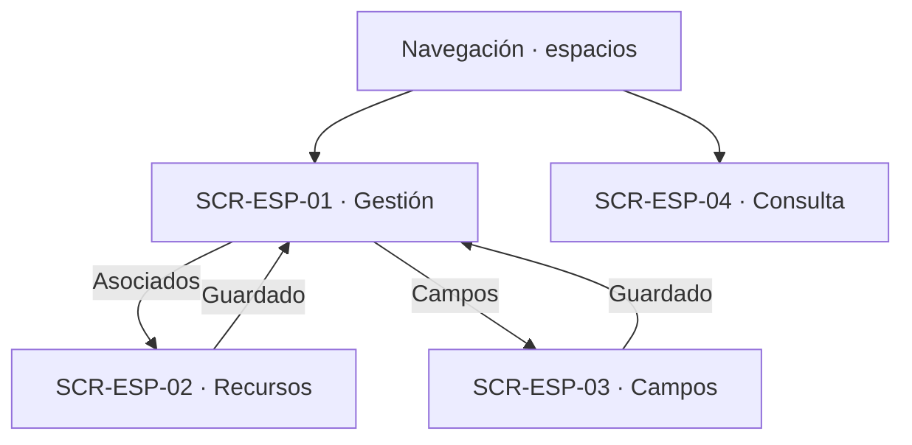

# Navegación funcional — Espacios

## Alcance y referencias

Conecta las cuatro superficies definidas en [screens.md](screens.md), a partir de [user-flow.md](user-flow.md), [business-rules.md](business-rules.md) y [data-model.md](data-model.md). No define URLs, pantallas externas ni nuevas operaciones. Los destinos externos son responsabilidades funcionales documentadas; los estados de error se mantienen en la superficie que originó la operación.

## Entradas e inicio

- **Acceso por rol:** el Técnico administra su unidad; el Administrador, cualquiera; el Usuario consulta. Sin permiso, el rechazo ocurre en la superficie que lo recibe.
- **Horario:** no hay superficie de horario en este módulo; el que se muestra es lectura de la unidad.

## Gestión, consulta y campos

| Origen | Acción o decisión | Destino / resultado | Trazabilidad |
|---|---|---|---|
| Navegación | Administrar espacios | SCR-ESP-01 | UF-ESP-01, UF-ESP-02, UF-ESP-10, UF-ESP-11 |
| SCR-ESP-01 | Datos inválidos o duplicados | SCR-ESP-01, corrección | RN-ESP-02 |
| SCR-ESP-01 | Impacto con reservas futuras | SCR-ESP-01, advertencia y confirmación | RN-ESP-HAB-05 |
| SCR-ESP-01 | Confirmada | SCR-ESP-01, totales; cancelaciones en `reservations` | RN-CAN-04 de reservations |
| SCR-ESP-01 | Ver asociados o campos | SCR-ESP-02, SCR-ESP-03 | UF-ESP-03, UF-ESP-05 |
| SCR-ESP-02 | Recurso de otra unidad o ya asociado | SCR-ESP-02, corrección | RN-ESP-REC-06, RN-ESP-REC-07 |
| SCR-ESP-02 | Retiro confirmado | SCR-ESP-02, fila deshabilitada | UF-ESP-04 |
| SCR-ESP-03 | Lista sin opciones o duplicado | SCR-ESP-03, corrección | RN-ESP-CAM-02, RN-ESP-CAM-03 |
| Navegación | Consultar espacios | SCR-ESP-04 | UF-ESP-12, UF-ESP-13 |

## Cruces con otros módulos

| Módulo | Cruce documentado | Naturaleza |
|---|---|---|
| auth | Permisos por rol y alcance en cada operación | Dependencia de autorización, sin pantalla propia aquí |
| resources | Catálogo de recursos y horario de la unidad | Dependencia de dato compartido (patrón reutilizado de FE-12) |
| reservations | Disponibilidad temporal y cancelaciones por deshabilitación | Dependencia funcional; este módulo no decide reservas |
| unidadOrganizacional | Unidades de pertenencia | Dependencia estructural |

## Efectos transversales sin pantalla propia

| Flujo | Decisión | Efecto sobre la interfaz y referencia |
|---|---|---|
| UF-ESP-14 | Uso durante una reserva | Superficie en `reservations`; aquí solo la configuración que consume |

## Verificación y asuntos sin resolver

- Revisados los catorce flujos, de `UF-ESP-01` a `UF-ESP-14`; la matriz de [screens.md](screens.md) deja trazabilidad de cada uno, incluido el único sin pantalla propia (`UF-ESP-14`).
- Todos los identificadores `SCR-ESP-XX` utilizados corresponden a las cuatro definiciones de ese documento. Los demás nodos de los diagramas son decisiones, resultados en la misma vista o módulos externos documentados.
- No se crea una pantalla de disponibilidad temporal: la resuelve `reservations`.
- Quedan aplicadas las decisiones sobre agrupar gestión, separar consulta por rol y agrupar los cinco flujos de campos. Se mantienen únicamente los asuntos fuera de esas decisiones: mecanismo de selección, destino tras guardar y retornos no definidos. Ninguna flecha presupone una solución a esos asuntos.
