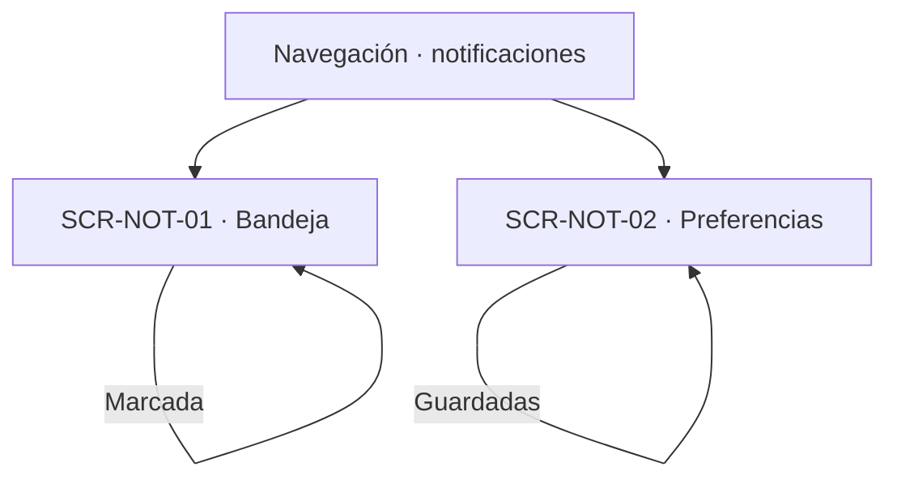

# Navegación funcional — Notifications

## Alcance y referencias

Conecta las dos superficies definidas en [screens.md](screens.md), a partir de [user-flow.md](user-flow.md), [business-rules.md](business-rules.md) y [data-model.md](data-model.md). No define URLs, pantallas externas ni nuevas operaciones. Los destinos externos son responsabilidades funcionales documentadas; los estados de error se mantienen en la superficie que originó la operación.

## Entradas e inicio

- **Acceso por cuenta:** todo opera sobre la cuenta de la sesión; consultar o marcar lo ajeno es indistinguible de lo inexistente.
- **Generación:** la origina cada módulo productor; aquí solo se consulta lo ya comunicado.

## Bandeja y preferencias

| Origen | Acción o decisión | Destino / resultado | Trazabilidad |
|---|---|---|---|
| Navegación | Abrir bandeja | SCR-NOT-01 | UF-NOT-01 |
| SCR-NOT-01 | Filtrar o paginar | SCR-NOT-01, subconjunto propio | RN-CON-01, RN-CON-03 |
| SCR-NOT-01 | Marcar propia | SCR-NOT-01, instante registrado | RN-EST-03, RN-EST-04 |
| SCR-NOT-01 | Marcar ajena o inexistente | SCR-NOT-01, denegación sin revelar | RN-CON-01 |
| SCR-NOT-01 | Referencia relacionada | Módulo propietario (consulta, no navegación fijada) | RN-CON-02 |
| Navegación | Abrir preferencias | SCR-NOT-02 | UF-NOT-02 |
| SCR-NOT-02 | Guardar | SCR-NOT-02, reemplazo completo | RN-PREF-01, RN-PREF-04 |
| SCR-NOT-02 | Tipo inválido o repetido | SCR-NOT-02, corrección | Contrato §3.2 |

## Cruces con otros módulos

| Módulo | Cruce documentado | Naturaleza |
|---|---|---|
| reservations | Eventos del ciclo de vida; referencias de la bandeja | Dependencia de origen y destino de consulta |
| resources | Flag de correo por unidad | Dependencia de dato (`RN-PREF-02`) |
| auth | Correos propios ignoran preferencias | Excepción documentada (`RN-PREF-03`) |
| Todos los productores | Generación de eventos y ocurrencias | Origen externo; aquí no se genera |

## Efectos transversales sin pantalla propia

| Flujo | Decisión | Efecto sobre la interfaz y referencia |
|---|---|---|
| UF-NOT-03 | Tarea programada sin iniciador | Sin superficie: entrega y reintentos invisibles aquí |
| Estado de envíos | No consultable desde este módulo | Ausencia deliberada del contrato |

## Verificación y asuntos sin resolver

- Revisados los tres flujos (uno sin iniciador humano); la matriz de [screens.md](screens.md) deja trazabilidad de cada uno.
- Todos los identificadores `SCR-NOT-XX` utilizados corresponden a las dos definiciones de ese documento. Los demás nodos de los diagramas son decisiones, resultados en la misma vista o módulos externos documentados.
- No se crea una pantalla de generación ni de estado de correos: el contrato no las expone.
- Quedan aplicadas las decisiones sobre separar bandeja de preferencias y sobre no revelar existencia ajena. Se mantienen únicamente los asuntos fuera de esas decisiones: presentación del tipo, destino tras actuar y retornos no definidos. Ninguna flecha presupone una solución a esos asuntos.
