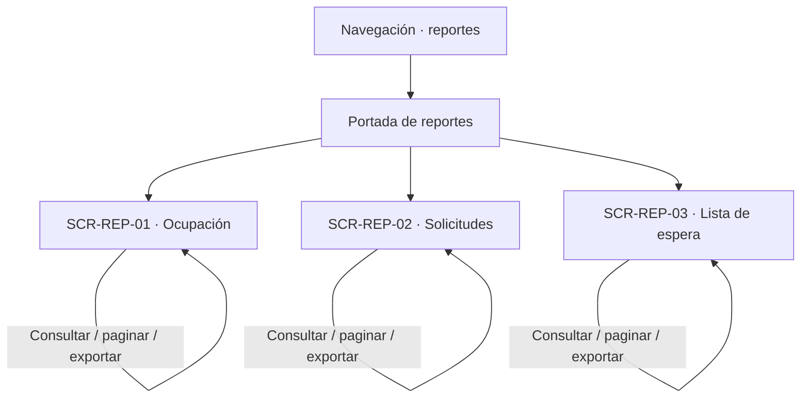

# Navegación funcional — Reports

## Alcance y referencias

Conecta las tres superficies definidas en [screens.md](screens.md), a partir de [user-flow.md](user-flow.md), [business-rules.md](business-rules.md) y [data-model.md](data-model.md). No define URLs, pantallas externas ni nuevas operaciones.

## Entradas e inicio

- **Acceso por rol:** el destino «Reportes» aparece a Técnico y Administrador ([layout.md](../../ui/layout.md)); un Usuario no lo ve. Es una aproximación de grano grueso: el permiso `reportes.consultar` y su ámbito los decide el servidor en cada consulta (`RN-AMB-03`).
- **Sin generación:** Reports no crea datos; toda actividad es una consulta iniciada por una persona (`RN-REP-02`).

## Consulta y exportación

| Origen | Acción o decisión | Destino / resultado | Trazabilidad |
|---|---|---|---|
| Navegación | Abrir reportes | Portada de reportes, con acceso a SCR-REP-01, SCR-REP-02 y SCR-REP-03 | UF-REP-01 |
| Portada | Elegir «Ocupación» | SCR-REP-01 | UF-REP-01 |
| Portada | Elegir «Solicitudes» | SCR-REP-02 | UF-REP-01 |
| Portada | Elegir «Lista de espera» | SCR-REP-03 | UF-REP-01 |
| SCR-REP-0x | Consultar con filtros válidos | Misma pantalla, resultado con su resumen | RN-VIS-01, RN-VIS-03 |
| SCR-REP-0x | Consultar con periodo inválido | Misma pantalla, corrección | RN-FIL-01, RN-FIL-02 |
| SCR-REP-0x | Consultar sin datos | Misma pantalla, ausencia de información | RN-REP-05, RN-VIS-04 |
| SCR-REP-0x | Consultar sin permiso | Misma pantalla, denegación sin revelar datos | RN-AMB-03, RN-AMB-05 |
| SCR-REP-0x | Paginar | Misma pantalla, mismos filtros de la consulta | RN-VIS-01 |
| SCR-REP-0x | Exportar (CSV o Excel) | Descarga del archivo con los filtros de la última consulta | UF-REP-02, RN-EXP-02, RN-EXP-05 |
| SCR-REP-0x | Exportar sin haber consultado | No se ofrece | UF-REP-02 (precondición) |

## Cruces con otros módulos

| Módulo | Cruce documentado | Naturaleza |
|---|---|---|
| reservations | Reservas, estados, periodos, horas de lista de espera | Fuente de consulta |
| resources | Unidades, recursos, versiones de horario (`RN-LAB-08`) | Fuente de consulta |
| espacios | Espacios y su unidad | Fuente de consulta |
| researchs | Proyectos y semilleros como dimensión de análisis | Fuente de consulta |
| auth | Permiso `reportes.consultar` y ámbito por unidad | Autorización (`RN-AMB`) |
| reservations (exportación en bruto) | `GET /api/reservas/exportacion` | Fuera de esta navegación: exporta reservas, no un reporte agregado |

## Efectos transversales sin pantalla propia

| Flujo | Decisión | Efecto sobre la interfaz y referencia |
|---|---|---|
| UF-REP-02 | Sin pantalla propia | Es una acción de cada reporte a la vista, no un destino |
| Trazabilidad de operaciones | No se consulta desde reports | Ausencia deliberada del contrato (`RN-HIS-04`) |

## Verificación y asuntos sin resolver

- La portada de reportes es una superficie de paso sin reglas propias; solo lleva a las tres pantallas.
- `dimension` distinta de `laboratorio` en solicitudes: no implementada por el servidor; no se ofrece (ver [screens.md](screens.md), ambigüedad 2).
