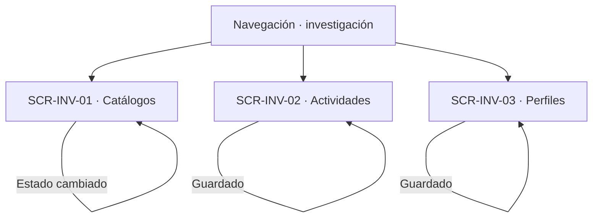
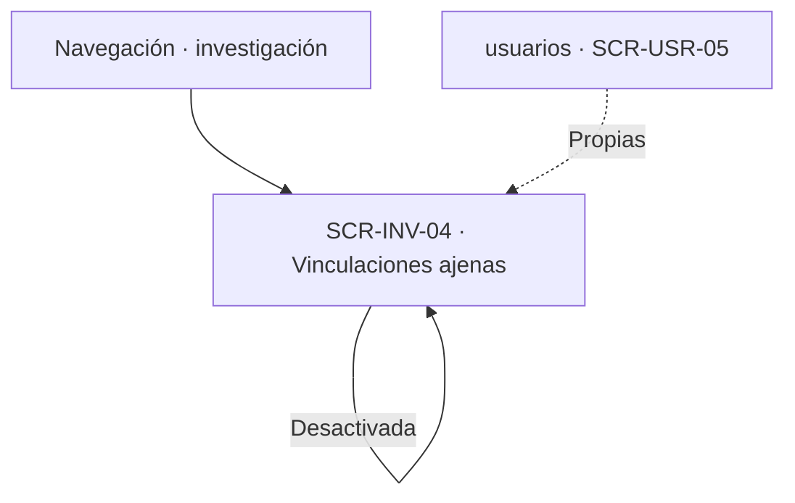

# Navegación funcional — Researchs

## Alcance y referencias

Conecta las cuatro superficies definidas en [screens.md](screens.md), a partir de [user-flow.md](user-flow.md), [business-rules.md](business-rules.md) y [data-model.md](data-model.md). No define URLs, pantallas externas ni nuevas operaciones. Los destinos externos son responsabilidades funcionales documentadas; los estados de error se mantienen en la superficie que originó la operación.

## Entradas e inicio

- **Acceso administrativo:** todas las superficies exigen Administrador con alcance global; el Técnico no administra estos catálogos ni vinculaciones ajenas. Sin ese alcance, el rechazo ocurre en la superficie que lo recibe.
- **Vinculaciones propias:** viven en `usuarios` (`SCR-USR-05`); aquí solo las ajenas.

## Catálogos, actividades y perfiles

| Origen | Acción o decisión | Destino / resultado | Trazabilidad |
|---|---|---|---|
| Navegación | Consultar catálogos | SCR-INV-01 | Contrato §2 |
| SCR-INV-01 | Estado cambiado | SCR-INV-01, confirmación | RN-IMP-07 de administration |
| Navegación | Administrar actividades | SCR-INV-02 | UF-INV-01 |
| SCR-INV-02 | Datos faltantes | SCR-INV-02, corrección | RN-ACT-01 |
| SCR-INV-02 | Guardado | SCR-INV-02, confirmación | RN-ACT-03, RN-ACT-04 |
| Navegación | Administrar perfiles | SCR-INV-03 | UF-INV-01 |
| SCR-INV-03 | Guardado | SCR-INV-03, confirmación | RN-INV-12, RN-INV-15 |
| SCR-INV-03 | Deshabilitado | SCR-INV-03; ya no ofrecido, asociaciones intactas | RN-INV-14, RN-INV-05 |

## Vinculaciones ajenas y cruces

| Origen | Acción o decisión | Destino / resultado | Trazabilidad |
|---|---|---|---|
| Navegación | Gestionar vinculaciones ajenas | SCR-INV-04 | UF-INV-01 |
| SCR-INV-04 | Duplicada activa | SCR-INV-04, corrección | Contrato §5.2 |
| SCR-INV-04 | Inactiva previa | SCR-INV-04, reactivada | RN-INV-11 |
| SCR-INV-04 | Desactivada, última activa | SCR-INV-04, aviso sin bloquear | RN-USR-11 de usuarios |
| `usuarios` | Vinculaciones propias | `SCR-USR-05`, no aquí | RN-INV-09, RN-INV-16 |
| `administration` | Importación confirmada | Catálogos escritos, visibles aquí | RN-IMP-01, RN-IMP-10 |
| `reservations` | Contextos históricos | Referencias intactas ante cambios | RN-CTX-07 de reservations |

## Cruces con otros módulos

| Módulo | Cruce documentado | Naturaleza |
|---|---|---|
| auth | Alcance global en cada operación | Dependencia de autorización, sin pantalla propia aquí |
| usuarios | Vinculaciones propias y catálogo habilitado para elegir | Dependencia funcional en ambos sentidos |
| administration | Importaciones que escriben estos catálogos | Dependencia de escritura; este módulo no orquesta cargas |
| reservations | Contextos históricos de reservas | Dependencia de conservación, sin pantalla compartida |

## Efectos transversales sin pantalla propia

| Flujo | Decisión | Efecto sobre la interfaz y referencia |
|---|---|---|
| Vinculaciones propias | Gestión del titular | Superficie en `usuarios`; aquí solo las ajenas |
| Importación masiva | Orquestación y confirmación | Superficie en `administration`; aquí el estado resultante |

## Verificación y asuntos sin resolver

- Revisado el único flujo (`UF-INV-01`) más las superficies de contrato sin flujo propio (§2, §4); la matriz de [screens.md](screens.md) deja trazabilidad de cada uno.
- Todos los identificadores `SCR-INV-XX` utilizados corresponden a las cuatro definiciones de ese documento. Los demás nodos de los diagramas son decisiones, resultados en la misma vista o módulos externos documentados.
- No se crea una pantalla de importación ni de vinculaciones propias: pertenecen a `administration` y `usuarios`.
- Quedan aplicadas las decisiones sobre separar las cuatro superficies y sobre no asociar entidades con laboratorios. Se mantienen únicamente los asuntos fuera de esas decisiones: mecanismo de selección, destino tras guardar y retornos no definidos. Ninguna flecha presupone una solución a esos asuntos.
