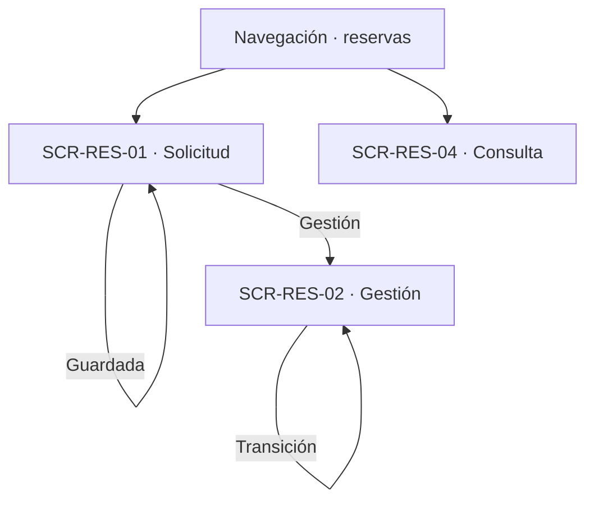
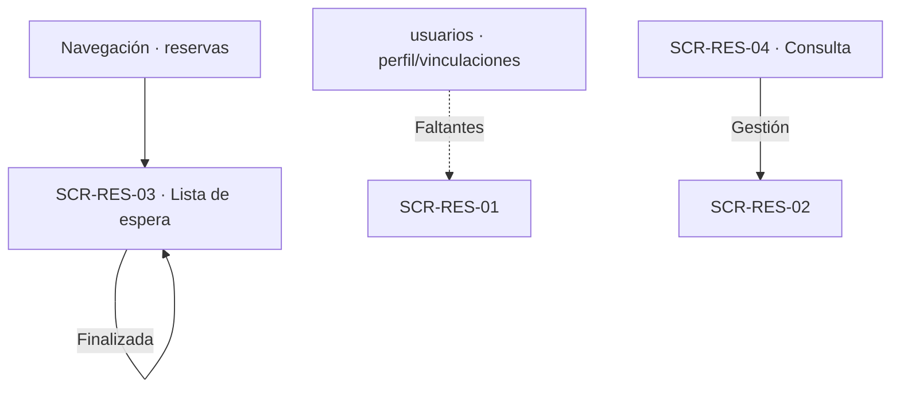

# Navegación funcional — Reservations

## Alcance y referencias

Conecta las cuatro superficies definidas en [screens.md](screens.md), a partir de [user-flow.md](user-flow.md), [business-rules.md](business-rules.md) y [data-model.md](data-model.md). No define URLs, pantallas externas ni nuevas operaciones. Los destinos externos son responsabilidades funcionales documentadas; los estados de error se mantienen en la superficie que originó la operación.

## Entradas e inicio

- **Acceso por rol:** el Usuario crea y consulta lo propio; el Técnico gestiona su unidad; el Administrador, cualquiera. Sin permiso, el rechazo ocurre en la superficie que lo recibe.
- **Perfil y vinculaciones:** sin actualización completa o sin vinculación válida, la creación orienta a `SCR-USR-01` o `SCR-USR-05` de usuarios; el bloqueo vive en esta pantalla (`UF-USR-11`).

## Solicitud y gestión

| Origen | Acción o decisión | Destino / resultado | Trazabilidad |
|---|---|---|---|
| Navegación | Nueva reserva | SCR-RES-01 | UF-RES-01 a UF-RES-05, UF-RES-08 |
| SCR-RES-01 | Disponibilidad consultada | SCR-RES-01, franjas sin garantía | UF-RES-19 |
| SCR-RES-01 | Guardada | SCR-RES-01, confirmación con estado inicial | RN-RES, RN-TIP |
| SCR-RES-01 | Edición en solicitada | SCR-RES-01, revalidación completa | UF-RES-24 |
| SCR-RES-01 | Ver gestión (Técnico) | SCR-RES-02 | UF-RES-07 |
| SCR-RES-02 | Aprobada o rechazada | SCR-RES-02, historial actualizado | RN-APR |
| SCR-RES-02 | Recursos agregados o retirados | SCR-RES-02, composición vigente | UF-RES-09, UF-RES-10 |
| SCR-RES-02 | Periodo negociado | SCR-RES-02, reprogramación o rechazo | UF-RES-15, RN-PROP |
| SCR-RES-02 | Ejecutada o finalizada | SCR-RES-02, transición registrada | UF-RES-13, UF-RES-14 |
| SCR-RES-02 | Cancelada | SCR-RES-02, compromiso liberado | UF-RES-11, RN-CAN-02 |

## Lista de espera, consulta y cruces

| Origen | Acción o decisión | Destino / resultado | Trazabilidad |
|---|---|---|---|
| Navegación | Lista de espera | SCR-RES-03 | UF-RES-05 |
| SCR-RES-03 | Viabilidad negativa | SCR-RES-03, rechazada en la misma transacción | Flujos de preparación |
| SCR-RES-03 | Finalizada con horas | SCR-RES-03, horas agregables por unidad | RN-TIP-PLE-08 |
| Navegación | Consulta y descargas | SCR-RES-04 | Detalle, `.ics`, FGL |
| `usuarios` | Perfil o vinculación faltante | Orientación a `SCR-USR-01`/`SCR-USR-05` | UF-USR-11 |
| `espacios` | Selector de espacios | Superficie de `FE-14` | RN-ESP |
| `recursos` | Selector de recursos | Superficie de `FE-12`/`FE-13` | RN-REC |
| `notifications` | Avisos del ciclo de vida | Sin pantalla propia aquí | RN-EVT |
| `reports` | Exportación agregada | Trasladada a `UF-REP-02` | UF-RES-18 |

## Cruces con otros módulos

| Módulo | Cruce documentado | Naturaleza |
|---|---|---|
| auth | Identidad y autorización en cada operación | Dependencia de autorización, sin pantalla propia aquí |
| usuarios | Perfil, vinculaciones y bloqueo de creación | Dependencia funcional en ambos sentidos |
| espacios | Selector de espacios y campos de la reserva | Dependencia de dato (superficies de FE-14) |
| recursos | Selector de recursos y configuración horaria | Dependencia de dato (superficies de FE-12/FE-13) |
| investigacion | Contextos de reserva | Dependencia de dato |
| notifications | Avisos de transiciones y recordatorios | Dependencia de comunicación |
| reports | Agregados y exportación trasladada | Sin pantalla compartida |

## Efectos transversales sin pantalla propia

| Flujo | Decisión | Efecto sobre la interfaz y referencia |
|---|---|---|
| UF-RES-12 | Cancelación automática | Efecto del sistema, visible como estado en `SCR-RES-04` |
| UF-RES-16 | Recordatorio | Tarea del sistema; sin superficie |
| UF-RES-17 | Adjunto `.ics` | Adjunto del correo, no pantalla |
| UF-RES-18 | Exportación trasladada | Superficie en `reports` |
| UF-RES-20 | Visibilidad | Configuración de `resources`; sin superficie aquí |
| UF-RES-21/22 | Transiciones automáticas | Tareas del sistema (API-16); visibles como estado |
| UF-RES-23 | Retiro automático | Efecto atómico al crear el préstamo, visible en composición |

## Verificación y asuntos sin resolver

- Revisados los veinticuatro flujos (uno trasladado); la matriz de [screens.md](screens.md) deja trazabilidad de cada uno, incluidos los siete sin pantalla propia.
- Todos los identificadores `SCR-RES-XX` utilizados corresponden a las cuatro definiciones de ese documento. Los demás nodos de los diagramas son decisiones, resultados en la misma vista o módulos externos documentados.
- No se crea una pantalla genérica con campos condicionales sin documentar: las cinco estrategias quedan como flujos distintos.
- Quedan aplicadas las decisiones sobre agrupar solicitud con edición, gestión por tipo y estado, y lista de espera separada. Se mantienen únicamente los asuntos fuera de esas decisiones: presentación del periodo por estrategia, orden de secciones, destino tras guardar y retornos no definidos. Ninguna flecha presupone una solución a esos asuntos.
