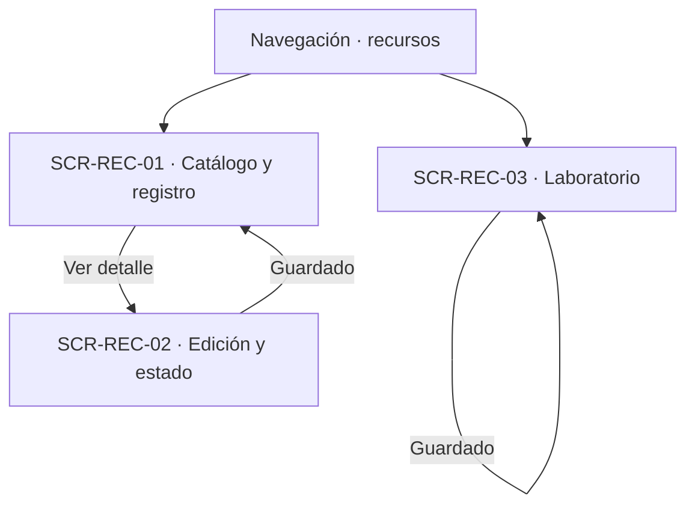
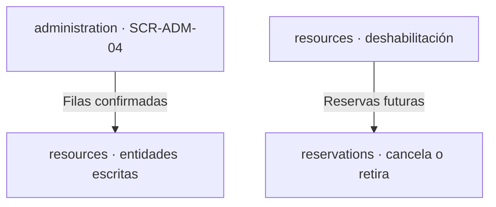

# Navegación funcional — Resources

## Alcance y referencias

Conecta las cuatro superficies definidas en [screens.md](screens.md), a partir de [user-flow.md](user-flow.md), [business-rules.md](business-rules.md) y [data-model.md](data-model.md). No define URLs, pantallas externas ni nuevas operaciones. Los destinos externos son responsabilidades funcionales documentadas; los estados de error se mantienen en la superficie que originó la operación.

## Entradas e inicio

- **Acceso por rol:** el Técnico opera solo sobre su unidad; el Administrador tiene alcance global. Sin permiso, el rechazo ocurre en la superficie que lo recibe.
- **Importación:** la carga vive en `administration` (`SCR-ADM-04`); aquí solo se documentan las validaciones propias que esa superficie muestra.

## Catálogo, edición y configuración

| Origen | Acción o decisión | Destino / resultado | Trazabilidad |
|---|---|---|---|
| Navegación | Administrar recursos | SCR-REC-01 | UF-REC-01 a UF-REC-05 |
| SCR-REC-01 | Datos inválidos o sin permiso | SCR-REC-01, corrección | RN-REC-07, RN-ROL-01 |
| SCR-REC-01 | Registro creado | SCR-REC-01, catálogo actualizado | UF-REC-01, UF-REC-02, UF-REC-03 |
| SCR-REC-01 | Ver detalle | SCR-REC-02 | UF-REC-05 |
| SCR-REC-02 | Validación fallida | SCR-REC-02, sin cambios | RN-EQP, RN-MOB, RN-OTR |
| SCR-REC-02 | Impacto con reservas `PRINCIPAL` | SCR-REC-02, advertencia y confirmación | RN-DES-06 |
| SCR-REC-02 | Confirmada | SCR-REC-02, totales; reservas tratadas por `reservations` | RN-DES-07, RN-CAN-04, RN-CAN-05 de reservations |
| SCR-REC-02 | Reasignar unidad | SCR-REC-02, unidad coincidente | UF-REC-10 |
| Navegación | Configurar laboratorio | SCR-REC-03 | UF-REC-13 |
| SCR-REC-03 | Horario inválido | SCR-REC-03, corrección | RN-LAB-04 |
| SCR-REC-03 | Guardado | SCR-REC-03; horario versionado sin reinterpretar | RN-LAB-08 |

## Importación y cruces

| Origen | Acción o decisión | Destino / resultado | Trazabilidad |
|---|---|---|---|
| `administration` | Carga de equipos validada | `SCR-ADM-04`; validaciones visibles de este módulo | UF-ADM-04, RN-IMP-02, RN-IMP-03, RN-IMP-06 |
| `reservations` | Reserva creada o aprobada | Usa el catálogo y la configuración vigentes | RN-REC-07, RN-LAB-05 |
| `reservations` | Deshabilitación con reservas futuras | Cancelaciones y retiros en `reservations` | RN-CAN-04, RN-CAN-05 de reservations |
| `espacios` | Horario aplicable | El de la unidad, sin horario propio | RN-ESP-DIS-02 de espacios |

## Cruces con otros módulos

| Módulo | Cruce documentado | Naturaleza |
|---|---|---|
| auth | Permisos por rol y alcance en cada operación | Dependencia de autorización, sin pantalla propia aquí |
| administration | Orquestación y confirmación de importaciones | Dependencia de conducción; este módulo aporta validaciones |
| reservations | Disponibilidad temporal, asignaciones, cancelaciones por deshabilitación | Dependencia funcional; este módulo no decide reservas |
| espacios | Horario de la unidad aplicable a sus espacios | Dependencia de dato compartido |
| unidadOrganizacional | Unidades responsables y reasignaciones | Dependencia estructural |

## Efectos transversales sin pantalla propia

| Flujo | Decisión | Efecto sobre la interfaz y referencia |
|---|---|---|
| UF-REC-11 | Comunicación entre módulos | Sin superficie: no es interacción de persona |
| UF-ADM-04 | Carga de equipos | Superficie en `administration`; aquí solo validaciones visibles |

## Verificación y asuntos sin resolver

- Revisados los trece flujos, de `UF-REC-01` a `UF-REC-13`; la matriz de [screens.md](screens.md) deja trazabilidad de cada uno, incluido el único sin superficie propia (`UF-REC-11`).
- Todos los identificadores `SCR-REC-XX` utilizados corresponden a las cuatro definiciones de ese documento. Los demás nodos de los diagramas son decisiones, resultados en la misma vista o módulos externos documentados.
- No se crea una pantalla de carga: pertenece a `administration`.
- Quedan aplicadas las decisiones sobre agrupar registro con consulta, edición con estado y unidad, y sobre referenciar la importación en vez de duplicarla. Se mantienen únicamente los asuntos fuera de esas decisiones: mecanismo de selección, destino tras guardar y retornos no definidos. Ninguna flecha presupone una solución a esos asuntos.
