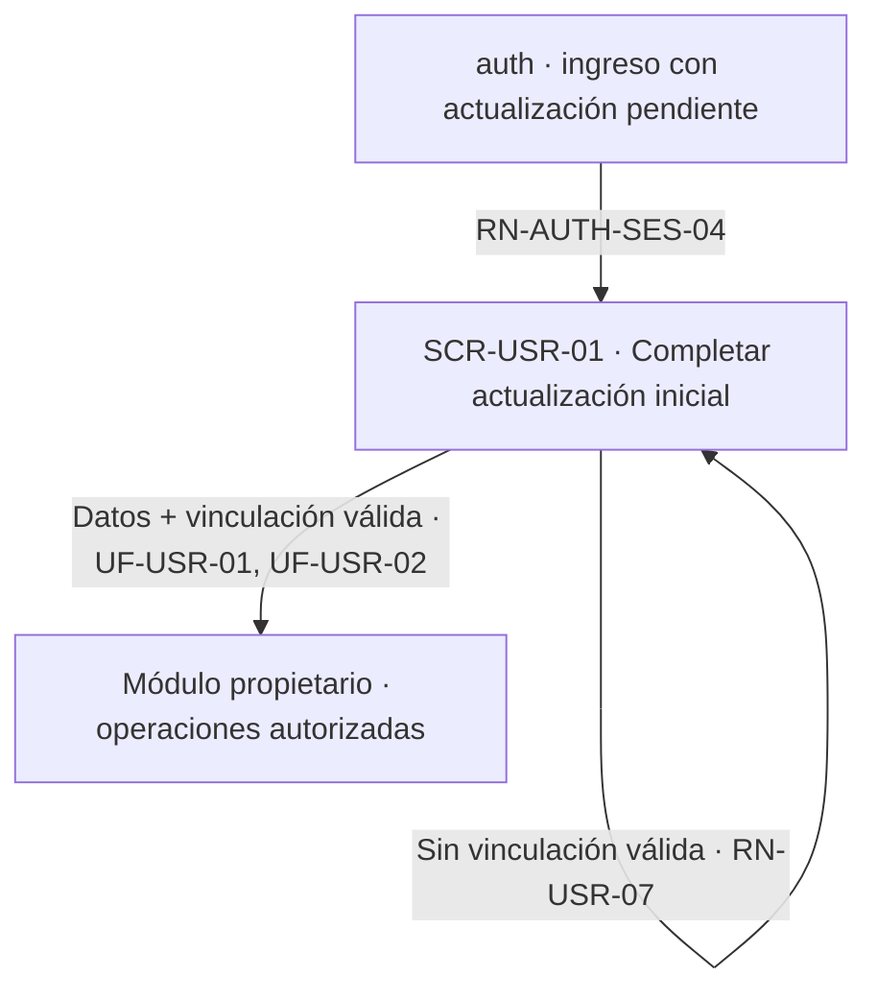
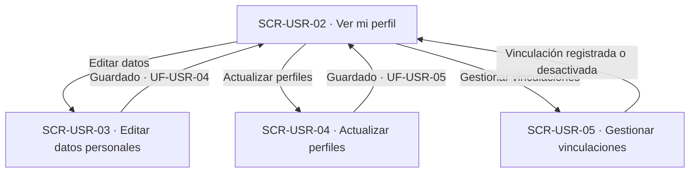
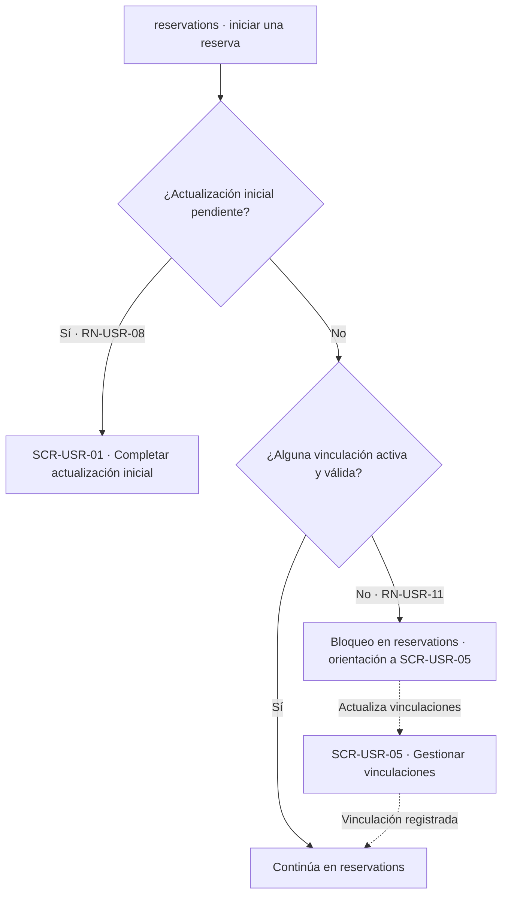

# Navegación funcional — Usuarios

## Alcance y referencias

Conecta las cinco superficies definidas en [screens.md](screens.md), a partir de [user-flow.md](user-flow.md), [business-rules.md](business-rules.md) y [data-model.md](data-model.md). No define URLs, pantallas externas ni nuevas operaciones. Los destinos externos son responsabilidades funcionales documentadas; los estados de error se mantienen en la superficie que originó la operación.

## Entradas e inicio

- **Conducción desde auth:** con la actualización inicial pendiente, `auth` conduce a `SCR-USR-01` en cada ingreso, sin importar si el origen fue autorregistro (`UF-USR-01`) o invitación (`UF-USR-02`) — es el mismo recorrido (`RN-AUTH-SES-04` de auth).
- **Acceso al perfil ya completo:** la entrada a `SCR-USR-02` desde el contexto autenticado; las fuentes no fijan el mecanismo o la ubicación de esa opción.
- **Bloqueo transversal:** mientras la actualización inicial esté pendiente, ninguna pantalla fuera de `SCR-USR-01` y `SCR-USR-05` (vinculaciones) es alcanzable para operaciones de negocio de otros módulos (`RN-USR-08`); ese rechazo ocurre en la pantalla que lo recibe, no aquí.

## Completar la actualización inicial

| Origen | Acción o decisión | Destino / resultado | Trazabilidad |
|---|---|---|---|
| auth (autorregistro o invitación) | Primer ingreso con actualización pendiente | SCR-USR-01 | UF-USR-01, UF-USR-02, RN-AUTH-SES-04 |
| SCR-USR-01 | Dato personal inválido o duplicado | SCR-USR-01, corrección | RN-DAT-01, RN-DAT-02 |
| SCR-USR-01 | Asociar proyecto/semillero, registrar pasantía/trabajo de grado | SCR-USR-01, vinculación registrada o reactivada | UF-USR-06 a UF-USR-09 |
| SCR-USR-01 | Ninguna vinculación activa y válida todavía | SCR-USR-01, no se completa la actualización | RN-USR-07, RN-USR-09 |
| SCR-USR-01 | Datos completos y al menos una vinculación válida | Actualización inicial completada; continúa a operaciones ya autorizadas, destino no fijado | UF-USR-01, UF-USR-02, UF-AUTH-10 de auth |
| SCR-USR-01 | La persona abandona antes de terminar | Progreso conservado; el mismo recorrido se retoma en el siguiente ingreso | UF-USR-01, UF-USR-02 |

El nodo `SCR-USR-01` es también donde se asocian proyectos/semilleros y se registran pasantías/trabajos de grado durante el primer ingreso: es la misma superficie de `SCR-USR-05`, no una tercera pantalla, mientras la actualización esté pendiente.

## Consulta y edición del perfil ya completo

| Origen | Acción o decisión | Destino / resultado | Trazabilidad |
|---|---|---|---|
| Contexto autenticado | Acceder al perfil | SCR-USR-02, consulta consolidada | UF-USR-03 |
| SCR-USR-02 | Acceder a editar datos | SCR-USR-03 | UF-USR-04 |
| SCR-USR-02 | Acceder a actualizar perfiles | SCR-USR-04 | UF-USR-05 |
| SCR-USR-02 | Acceder a gestionar vinculaciones | SCR-USR-05 | UF-USR-06 a UF-USR-10 |
| SCR-USR-03 | Dato inválido o duplicado | SCR-USR-03, corrección | RN-DAT-01, RN-DAT-02 |
| SCR-USR-03 | Cambios guardados | SCR-USR-02, con los datos actualizados | UF-USR-04 |
| SCR-USR-04 | Combinación de perfiles no permitida | SCR-USR-04, rechazo | RN-INV-12 a RN-INV-16 de investigacion |
| SCR-USR-04 | Selección guardada | SCR-USR-02, perfiles vigentes actualizados | UF-USR-05 |

## Gestión de vinculaciones y su efecto sobre las reservas

| Origen | Acción o decisión | Destino / resultado | Trazabilidad |
|---|---|---|---|
| SCR-USR-05 | Asociar proyecto o semillero ya vinculado (activo) | SCR-USR-05, sin duplicar | UF-USR-06, UF-USR-07, RN-INV vía investigacion |
| SCR-USR-05 | Asociar proyecto o semillero con vinculación inactiva previa | SCR-USR-05, reactiva la misma relación | UF-USR-06, UF-USR-07 |
| SCR-USR-05 | Registrar pasantía o trabajo de grado válidos | SCR-USR-05, vinculación registrada | UF-USR-08, UF-USR-09 |
| SCR-USR-05 | Desactivar la última vinculación activa | SCR-USR-05, aviso de bloqueo de nuevas reservas | UF-USR-10, RN-USR-11 |
| SCR-USR-05 | Desactivar una vinculación no siendo el titular ni Administrador global | SCR-USR-05, sin modificar | UF-USR-10 |
| Módulo reservations, al iniciar una reserva | Actualización inicial pendiente | SCR-USR-01 | UF-USR-11, RN-USR-08 |
| Módulo reservations, al iniciar una reserva | Actualización inicial completa, sin ninguna vinculación activa y válida | Bloqueo en la pantalla de reservations, con orientación a SCR-USR-05 | UF-USR-11, RN-USR-11 |
| Módulo reservations, al iniciar una reserva | Al menos una vinculación activa y válida | Continúa en reservations, sin superficie propia de usuarios | UF-USR-11 |

`UF-USR-11` no tiene superficie propia en este módulo: los dos nodos de decisión ocurren en `reservations`, que solo consulta la condición de perfil y vinculaciones de este módulo.

## Efectos transversales sin pantalla propia

| Flujo | Decisión | Efecto sobre la interfaz y referencia |
|---|---|---|
| UF-USR-11 | Actualización inicial pendiente al iniciar una reserva | Conduce a SCR-USR-01, sin superficie propia en reservations para este caso (RN-USR-08) |
| UF-USR-11 | Sin vinculación activa y válida al iniciar una reserva | Bloqueo en la pantalla de creación de reservations, con orientación a SCR-USR-05, sin bloquear el inicio de sesión ni reiniciar la actualización inicial (RN-USR-11) |
| RN-USR-08 | Actualización inicial pendiente, operación de negocio ajena a este módulo | Rechazo `403 PERFIL_INICIAL_PENDIENTE` en la pantalla del módulo que la recibe; no es una superficie de usuarios |

## Cruces con otros módulos

| Módulo | Cruce documentado | Naturaleza |
|---|---|---|
| auth | Conducción a SCR-USR-01 cuando la actualización inicial está pendiente (RN-AUTH-SES-04); correo inmutable compartido con auth.cuentas | Dependencia de conducción y de dato compartido, sin pantalla propia de auth aquí |
| investigacion | Catálogo de perfiles, proyectos y semilleros; validación y persistencia de vinculaciones, pasantías y trabajos de grado | Dependencia funcional; este módulo orquesta, investigacion valida y persiste |
| administration | Creación y administración de identidades de Usuario y fichas de Personal (UF-ADM-02, UF-ADM-03); no tiene pantalla en este documento | Fuera de alcance de screens.md — pertenece a administration |
| reservations | Consulta la condición de perfil y vinculaciones para permitir o bloquear la creación de una reserva (RN-USR-11); conserva referencias históricas a vinculaciones desactivadas | Dependencia funcional en ambos sentidos, sin pantalla compartida |

## Verificación y asuntos sin resolver

- Revisados los once flujos, de `UF-USR-01` a `UF-USR-11`; la matriz de [screens.md](screens.md) deja trazabilidad de cada uno, incluido el único sin pantalla propia (`UF-USR-11`).
- Todos los identificadores `SCR-USR-XX` utilizados corresponden a las cinco definiciones de ese documento. Los demás nodos de los diagramas son decisiones, resultados en la misma vista o módulos externos documentados.
- No se crea una pantalla para la administración de identidades (`UF-ADM-02`, `UF-ADM-03`): pertenece a `administration`.
- Quedan aplicadas las decisiones sobre agrupar `SCR-USR-01` para ambos orígenes de actualización inicial y sobre unificar las cinco vinculaciones en `SCR-USR-05`, ya documentadas en `screens.md`. Se mantienen únicamente los asuntos fuera de esas decisiones: mecanismo de selección del catálogo, destino tras completar la actualización inicial y retornos no definidos. Ninguna flecha presupone una solución a esos asuntos.
